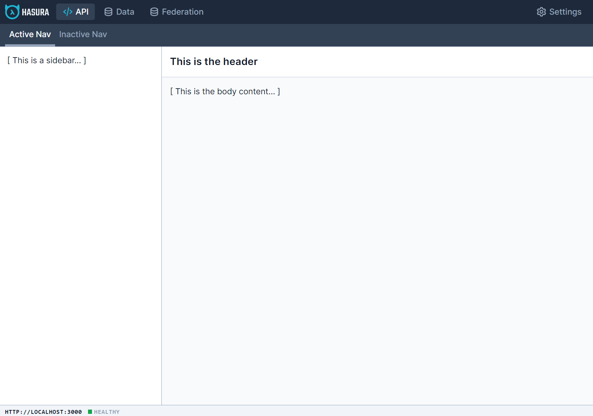

This is a design sample which contains a simplified version of our design space.

It includes the sample boilerplate (Svelte / Vite / Tailwind) and some sample layouts. 

## Getting Started
- Install NPM
- Navigate to directory, run the following to install dependancies and run dev server:

```
npm install && npm run dev
```

Development environment should be running on `http://localhost:3000`

* When adding new route/page you may need to restart your development environment for them to take effect - `CTRL+C` and then `npm run dev`.
** Page hot-refresh should work normally.

## Structure
Within your `/src` folder you have the following structure:
- 📄 app.css     - `globally defined CSS (loads Tailwind and component shortcuts - you shouldn't need to use this too often)`
- 📄 main.js     - `entrypoint for Svelte (you shouldn't need to use this)`
- 📄 App.svelte  - `index of your project - contains your page-route URL definitions`
- 📁 /components - `re-usable components, in this case the header and footer`
- 📁 /pages      - `page components - this is where the designs go`

## Steps for creating a new page
1. Create a new `.svelte` file under `/pages`
2. Import file in the `script` tage of `App.svelte`
3. In `App.svelte` add the page's path to the `<router>` below, and reference the imported page component

## Setting up your page for design
- Svelte is nice in that it doesn't have too much special syntax or gotchas.
- For a basic page you can add `<style>` and `<script>` tags just like you would in a flat HTML design.
- If you add `<style>` tags in a component, they will be scoped to the component.

## Available starter  templates
- 📁 /pages
    - 📁 /kit
        - 📄 LayoutFullscreen.svelte - `http://localhost:3000/layout/fullscreen`
        - 📄 LayoutSidebarLeft.svelte - `http://localhost:3000/layout/sidebar-left`
        - 📄 LayoutSidebarRight.svelte - `http://localhost:3000/layout/sidebar-right`
        - 📄 LayoutSidebarBoth.svelte - `http://localhost:3000/layout/sidebar-both`